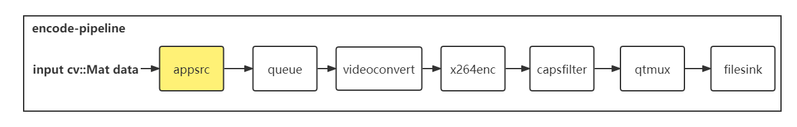

## 介绍
* 这个项目是一个使用`gstreamer`库在高通的`RB5`平台编译运行的项目
* 读视频每一帧：使用了`appsink`从管道中取出数据传到管道外的`cv::Mat`

* 写视频每一帧：使用了appsrc将数据输入管道，并且使用filesink接受数据


## 运行
* 需要在linux-ubuntu下运行，安装gstreamer可参考[gstreamer docs](https://gstreamer.freedesktop.org/documentation/installing/on-linux.html?gi-language=c)
```
apt-get install libgstreamer1.0-dev libgstreamer-plugins-base1.0-dev libgstreamer-plugins-bad1.0-dev gstreamer1.0-plugins-base gstreamer1.0-plugins-good gstreamer1.0-plugins-bad gstreamer1.0-plugins-ugly gstreamer1.0-libav gstreamer1.0-doc gstreamer1.0-tools gstreamer1.0-x gstreamer1.0-alsa gstreamer1.0-gl gstreamer1.0-gtk3 gstreamer1.0-qt5 gstreamer1.0-pulseaudio
```
* 运行该项目可以参考如下命令
```
mkdir build
cd build
cmake ..
make -j4
cd bin
# 你应该将input.mp4拷贝到根目录下的input文件夹中
./VideoReaderDome ../../input/input.mp4 ../../input
./VideoWriterDome ../../input/input.mp4 ../../input/output.mp4
```